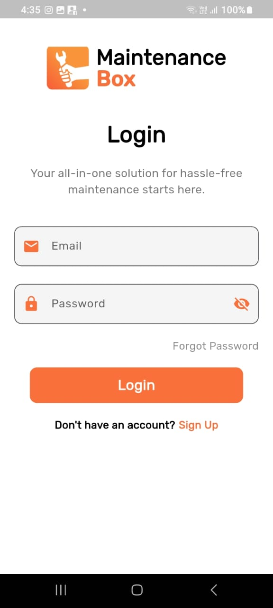

# Login Page UI

This is a simple **Login Page UI**, developed as a learning project in **Flutter**.  
In this project, I practiced layout structuring with **Row**, **Column**, **SafeArea**, and **SingleChildScrollView** to handle screen responsiveness and avoid overflow errors.  
Additionally, **TextFormField**, **Containers**, and other widgets were used to enhance the UI.

## 📷 Screenshot

---

## 📦 Widgets Used

| Widget                  | Description                                                                |
| ----------------------- | -------------------------------------------------------------------------- |
| `MaterialApp`           | Wraps the entire app and provides Material Design structure.               |
| `Scaffold`              | Basic layout structure with background color and app bar.                  |
| `SafeArea`              | Ensures content doesn't overlap with system UI (e.g. notches, status bar). |
| `SingleChildScrollView` | Allows scrolling to prevent overflow on smaller screens.                   |
| `Column`                | Arranges child widgets vertically.                                         |
| `Row`                   | Arranges child widgets horizontally.                                       |
| `Container`             | Used for styling, padding, margins, and layout structure.                  |
| `Text`                  | Displays static text.                                                      |
| `TextFormField`         | A form field for user input with built-in validation.                      |
| `SizedBox`              | Adds fixed space between widgets.                                          |
| `Padding`               | Adds spacing around widgets.                                               |
| `Icon`                  | Displays Material Design icons.                                            |

---

## 🎯 Learning Goals

- Mastering layout structure using Rows and Columns.
- Avoiding overflow using `SingleChildScrollView`.
- Using `SafeArea` to manage UI within screen boundaries.
- Creating custom input fields with `TextFormField`.
- Designing responsive and interactive login UI.

---

📧 Feel free to modify or improve the UI further!

---

SRAABIA
